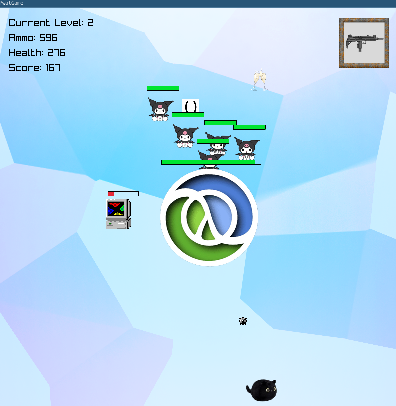

# Pwatgame: A bullet hell game engine in C++ and Raylib

My first attempt at making a game, perhaps the start of a rabbit hole into graphics engine programming, or just yet another systems project.

You will play as PwatPwat, a cute blob cat plush who needs to claim her throne as the cutest one ever! But some jealous enemies are getting on your way. Fight your way throughout different levels, refill your health with drinks, and refill your ammo with food, scattered across the map. Discover different weapons to use and fight different, equally evil mini bosses.

## Controls:

- Press the arrow keys to move across the map!
- Press the space key to shoot projectiles towards enemies!
- A mini boss will appear at the end of each level, each with a different attack pattern. Make sure to defeat them!

## Overview:

- **Game Modes**: 
  Each level has different weapon and enemy data, with slightly increasing difficulty and a different miniboss for each level.

  - **Default Deathless mode**: Complete all four levels at once. Score and ammo persists throughout levels, so try to get the highest score you can. If you run out of health, you will have to restart all over from level 1 again. Access it by selecting "Play Game" in the Main Menu.
  - **Play From Level**: Start from a specific level. Access it by choosing "Select Level" in the Main Menu. If you run out of health, you will simply restart from that level. Score, ammo and health will be reset at the beginning of each level.

- **Music Composed and Arranged by myself**: The sound effects were picked up from opengameart.org, but I composed the soundtrack that you can hear throughout the game. 

- **Lua scripting layer**: allows the editing of Enemy, Projectiles, Mini Boss data, Enemy and Item scheduling without recompiling the game engine, using some simple Lua tables with data. On the C++ side, it is handled using `std::expected` for safety and monadic operation chaining. I also made usage of `Concepts` for Item scheduling.

- **Statically templated cache pools for Enemies, Projectiles and Mini Bosses:** these spawns without heap allocation, allowing optimal performance and prevents the game engine from spawning an excessive amount of objects, therefore preventing frame losses as well.

- **Terminal logging for debugging during development**: along with the default Raylib logging, I have also added my own logging to be able to quickly troubleshoot any issues.

- **Usage of CMake as a build tool**: for better multi platform compatibility and reliable compilation. Raylib and lua dependencies are also handled by CMake.

## Concepts for levels:

#### Level 1 - Windows stage
This level is fast paced, chaotic but forgiving, themed around a retro Windows imagery. There is a large number of enemies and projectiles, but the patterns are predictable you are also provided with a lot of food and drinks.

#### Level 2 - Lisp stage
This one is themed around math and functional programming. It is slower, requiring more precision from the player. Projectiles and enemies has elegant patterns, does a lot of damage, and sometimes requires memorizing patterns. Items are also pretty scarce.

#### Level 3 - Java stage
This level is office themed. It is also pretty slow, but cluttered and the patterns are awkward on purpose. The player will need to get over the cognitive overhead if they want to pass this level.

#### Level 4 - Rust stage
This final level requires precision again but is also fast paced, and needs the player to have a short reaction window. Projectiles from both the player and enemies deals a lot of damage, making it pretty unforgiving.

## Download:
- I am figuring that out right now. I will make the game playable on several platforms.

## Building:

- Make sure to have a C++23 compatible compiler, and to have a fairly recent version of CMAKE as well. This project was built using GCC 14.2 across my Trixie Debian and Arch Linux computers.
- If you decide to run the CMAKE script, it will download the Raylib and Lua C libraries if they are missing from your machine.

Use the Linux_build.sh script to compile on Linux. This shell script will automatically use CMAKE and create a new `build/` folder and generate a `pwatgame` binary that is compatible with Unix systems.

## Credits

- Game Engine, Music, Scripting, Direction, UI, Marketing : Rin
- **Special thanks to:**
  - Mom,
  - My cute girlfriend,
  - Raysan5, creator of Raylib.
